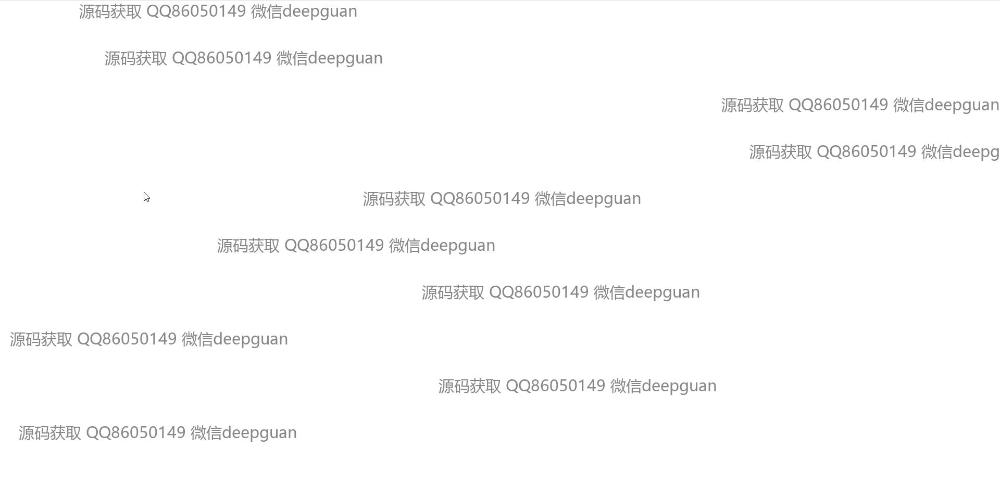
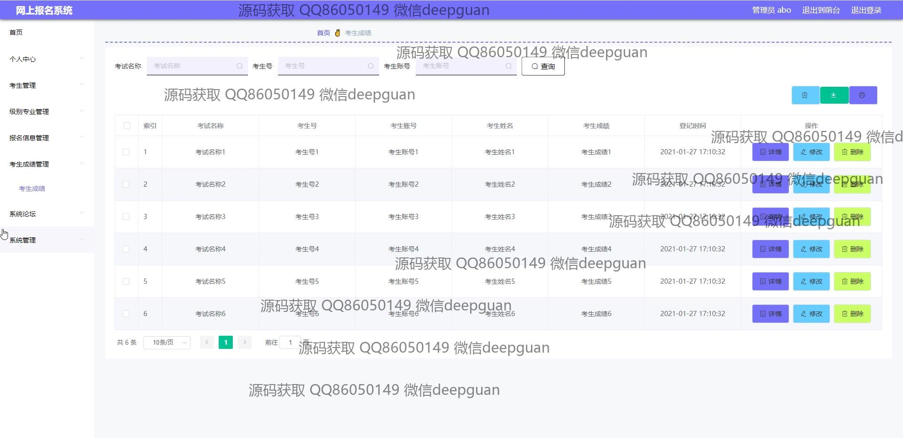
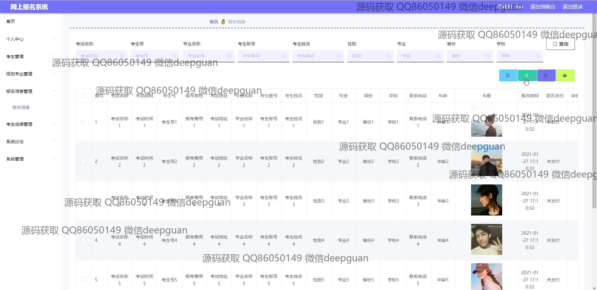
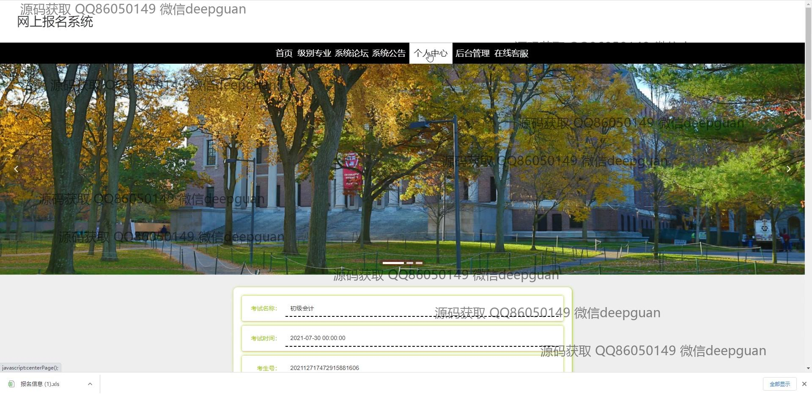

<h1 align="center">的高校网上报名系统vue</h1>

## 简介
高校网上报名系统：角色分为管理员、用户；支持考生注册、报名信息管理、考生成绩管理、系统公告发布、论坛互动、轮播图管理等功能，界面简洁高效，操作便捷。    --计算机毕业设计源码；毕设源码；java毕业设计源码

## 联系方式

<h3 align="center">获取完整代码与数据库文件 + 微信：deepguan QQ: 86050149 QQ群: 783742310</h3>

<h3 align="center">可帮忙远程部署 包运行成功！提供远程部署、修改代码、设计文档指导、代码讲解等服务！</h3>

## 功能介绍（完整见运行截图）
管理员：基本功能包括登录、注册和退出。管理系统提供了一系列模块，如个人中心、考生管理、成绩管理、级别专业管理、系统公告、考生论坛和系统管理。此外，管理员还能够管理报名信息、编辑和发布系统公告、管理轮播图以及导出、查看和编辑考生成绩。

用户：用户可以进行基本的信息注册、登录和退出。个人中心允许用户编辑和更新个人信息，如用户名、电子邮箱、身份证、所在省份和学校。用户可以通过报名信息管理功能进行考试名称、专业名称、及其他相关信息的选择和填写。系统论坛和公告模块提供了平台互动和信息获取的渠道，通过评论和系统公告增强用户体验和信息传达。

## 运行截图

本代码来源于网络,仅供学习参考使用!

